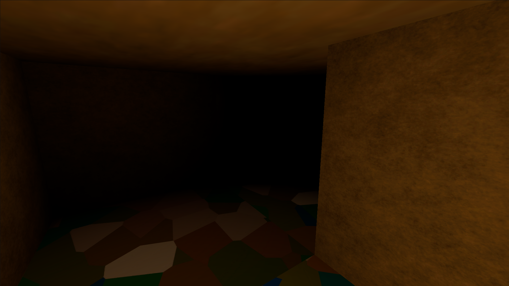

# The Unknown Labyrinth

A first-person horror maze game built in **Unity** and shipped to the browser with **WebGL**. You are a player in the winding labyrinth with only a small bubble of light around you. Find your way through long corridors, a concentric-circle chamber and the looping Catacombs to reach the exit.

### ▶ [Play it in your browser](https://aysh-mzmdr.github.io/The_Unknown_Labyrinth/)

No install or download needed. It runs on most desktop browsers.



---

## Table of Contents

- [About the Game](#about-the-game)
- [Controls](#controls)
- [Tech Stack](#tech-stack)
- [Engineering Accomplishments](#engineering-accomplishments)
  - [Procedural maze generation with composable zones](#1-procedural-maze-generation-with-composable-zones)
  - [Custom radial fog shader (Beer–Lambert)](#2-custom-radial-fog-shader-beerlambert-law)
  - [Fixing a frame-order race condition in the Animator](#3-fixing-a-frame-order-race-condition-in-the-animator)
  - [Animation-driven audio](#4-animation-driven-audio)
  - [Responsive first-person controller](#5-responsive-first-person-controller)
  - [Procedural victory sequence](#6-procedural-victory-sequence)
  - [Shipping Unity to the web on GitHub Pages](#7-shipping-unity-to-the-web-on-github-pages)
- [Project Structure](#project-structure)
- [Running Locally](#running-locally)

---

## About the Game

The Unknown Labyrinth is a small, atmospheric exploration game. Its structure follows a hand-drawn maze sketch:

- **The Main Maze**: long, twisting corridors with few but deep dead ends.
- **The Concentric Circle Chamber**: a hand-built zone of nested circular walls set into the grid maze.
- **The Catacombs**: a denser, harder section with extra loops, so you can't just follow one wall to get out.
- **The Exit**: reaching it plays a victory sequence with fireworks, music and a "YOU WON!!!!" banner.

The game has a **main menu** with an animated background camera and a lit 3D preview of the clown enemy. The player is a **fully animated, textured character** with footstep audio. The **radial fog** means you can only see a few metres ahead.

## Controls

| Action | Input |
|---|---|
| Move | `W` `A` `S` `D` / Arrow keys |
| Look around | Mouse |
| Release / re-capture mouse | `Esc` |
| Menu navigation | Mouse hover / click, or keyboard |

## Tech Stack

| Layer | Technology |
|---|---|
| Engine | **Unity 2022.3 LTS** (2022.3.45f1), Built-in Render Pipeline |
| Gameplay code | **C#** (MonoBehaviours, Coroutines, `StateMachineBehaviour`) |
| Rendering | Custom **HLSL / ShaderLab** shader (`Custom/RadialFogTextured`) |
| Animation | Unity **Mecanim** Animator (Idle ↔ Walking state machine), FBX character rigs |
| UI | Unity UI (uGUI) with legacy `Text`, and `EventSystem` for mouse + keyboard navigation |
| Audio | Unity `AudioSource` with separate tracks for the menu, gameplay and victory, plus looping footsteps |
| Physics | `CharacterController` collision, trigger volumes |
| VFX | Runtime-built `ParticleSystem` + dynamic point lights |
| Platform / Build | **WebGL** (WebAssembly + JavaScript loader) |
| Hosting | **GitHub Pages**, served from the `/docs` folder |
| Tooling | Visual Studio / VS Code, Git, [Unity MCP](https://github.com/CoplayDev/unity-mcp) for editor automation |

---

## Engineering Accomplishments

### 1. Procedural maze generation with composable zones

The labyrinth is a **perfect maze**: a spanning tree over a grid. That means every cell can be reached and there is exactly one path between any two cells. It was generated with **randomized recursive backtracking** (depth-first search with an explicit stack) and then baked into the scene as about **750 wall segments** (`WallH` / `WallV`) plus **12 curved arc pieces** for the circle chamber.

**Why recursive backtracking instead of Prim's or Kruskal's?** All three produce a perfect maze. The difference is how the maze *feels*:

| Algorithm | Result | Fit for this project |
|---|---|---|
| Kruskal's (random edges + union-find) | Even, "braided" texture with short passages everywhere | No strong shape. Its global edge list is harder to combine with hand-built zones |
| Prim's (grow a frontier) | Many short dead ends, dense branching | Too cramped and twisty |
| **Recursive backtracking (DFS)** | Long, winding, "river-like" corridors with fewer, longer dead ends | Matched the hand-drawn sketch |

The DFS approach also made **zones easy to combine**:
- **Circle chamber:** its cells are excluded from the DFS neighbour candidates, so the main maze never carves into them. A hand-built concentric-circle area then fits in cleanly.
- **Catacombs:** a second pass reopens walls at dead ends in that region. This adds loops, which makes it harder to navigate and breaks the "follow one wall" strategy.

### 2. Custom radial fog shader (Beer–Lambert law)

**File:** [`Assets/Shaders/RadialFogTextured.shader`](Assets/Shaders/RadialFogTextured.shader)

Unity's built-in fog is based on **view depth**. It looks like a flat wall of haze in front of the camera, not a bubble of light around the player. I wrote a custom unlit textured shader that computes the true **Euclidean distance** from the camera for each pixel:

```hlsl
float dist = distance(_WorldSpaceCameraPos, i.worldPos);
float t    = saturate((dist - _FogStart) / (_FogEnd - _FogStart));
```

The fog falloff follows the **Beer–Lambert law**. Light passing through an absorbing medium decays exponentially, `I(x) = I₀·e^(−μx)`, so the amount hidden by fog is `1 − e^(−μx)`:

```hlsl
float k = 3.5;
float fogFactor = (1.0 - exp(-k * t)) / (1.0 - exp(-k));
col.rgb = lerp(col.rgb, _FogColor.rgb, fogFactor);
```

Two details matter here:
- **Exponential, not linear:** the scene darkens quickly and then stays dim for a while, the way real fog does. A linear ramp looks mechanical.
- **Normalizing by `(1 − e^(−k))`:** the raw exponential only reaches about 0.97 at `t = 1`, which leaves a faint ghost of the wall at maximum distance. Dividing by that value makes the curve hit exactly 0 at the near edge and exactly 1 at the far edge.

My first version had the sign backwards: it stayed bright for most of the range and then dropped straight to black. I fixed it by re-deriving the formula from the transmittance equation instead of tweaking constants until it looked right.

### 3. Fixing a frame-order race condition in the Animator

**Files:** [`VictorySequence.cs`](Assets/Scripts/VictorySequence.cs), [`MazeFPController.cs`](Assets/Scripts/MazeFPController.cs), [`WalkingAudioSync.cs`](Assets/Scripts/WalkingAudioSync.cs)

**Symptom:** if you held a movement key while crossing the exit trigger, the character sometimes kept walking in place and the footstep audio kept playing, even though the code had forced it into idle.

**Root cause:** the Animator uses an `IsMoving` bool with instant transitions (no exit time). The first fix forced the Animator into the idle *state* but didn't reset the *bool parameter*. `OnTriggerEnter` runs during the physics step. Depending on where that lands in the frame, the movement script's `Update()` can run once more in the same frame after it has been disabled. When that happened:

1. The trigger fires → the game forces Idle and stops the audio
2. In the same frame, the movement script sets `IsMoving = true` again
3. The instant transition switches the Animator back to Walking
4. `OnStateEnter` on the Walking state starts the footstep audio again

**Fix:**
- Reset the **parameter** as well as the state: `SetBool("IsMoving", false)` plus `Play("Standing Idle")`.
- Don't rely on winning the race once. The game freezes the character **synchronously** inside `OnTriggerEnter`, then runs the same freeze again **one frame later** (`yield return null` in a coroutine). By then the controller is definitely disabled, so the second freeze always holds.
- I verified the fix by **deliberately reproducing the race** (injecting a stray `SetBool(true)` after the freeze), not just by checking that it looked right.

### 4. Animation-driven audio

Footsteps are driven by a `StateMachineBehaviour` attached to the **Walking** animator state. The sound starts in `OnStateEnter` and stops in `OnStateExit`. The audio is therefore tied to what the player *sees*, not to raw input, so footsteps can't play while the character is idle, and the reverse can't happen either.

### 5. Responsive first-person controller

[`MazeFPController.cs`](Assets/Scripts/MazeFPController.cs) is built on Unity's `CharacterController`:
- Mouse-look with yaw on the body and clamped pitch (±80°) on a separate camera pivot.
- Movement normalized across WASD and the arrow keys, so diagonal movement isn't faster.
- **Hard-stop handling:** tapping the opposite direction and releasing it snaps the character to a stop and resets the animation to idle. This avoids the "sliding" feel from conflicting inputs.
- `Esc` switches cursor lock, which matters in a browser where the page captures the pointer.

### 6. Procedural victory sequence

[`VictorySequence.cs`](Assets/Scripts/VictorySequence.cs) builds the whole ending **at runtime, from code**, with no prefabs:
- A scaled screen-space canvas with a pulsing "YOU WON!!!!" banner that has an outline and a drop shadow.
- Fireworks: each burst is a `ParticleSystem` configured in code (sphere emitter, 40-particle burst, gravity, alpha fade over lifetime) with a short-lived **coloured point light** that fades over 0.4 s. The light briefly illuminates lit objects such as the player model. The maze walls use the unlit fog shader, so they don't react to it.
- The particle material is a **direct serialized reference** (`FireworkParticle.mat`, additive shader), so Unity always includes its shader in the build. A runtime `Shader.Find` can't be trusted for this, because shaders that no asset references get stripped. If the reference is ever missing, the code falls back to `Sprites/Default`, which is always included. Bursts clean themselves up with `stopAction = Destroy`.
- A fallback shader lookup (`Particles/Standard Unlit` → `Legacy Shaders/Particles/Additive`) in case one shader is stripped from the build. Bursts clean themselves up with `stopAction = Destroy`.
- A switch from the gameplay music to the victory music.

### 7. Shipping Unity to the web on GitHub Pages

- Built for **WebGL** and deployed from the repo's `/docs` folder to GitHub Pages, so each build is live without a separate server.
- **Build compression is disabled.** GitHub Pages can't set the `Content-Encoding` headers that Brotli- or Gzip-compressed Unity builds need, and compressed builds fail to load there. Shipping uncompressed `.wasm` / `.data` files makes the build load reliably with plain static hosting.
- WebGL data caching is enabled so returning players don't download the build again.
- The resolution is left at the default so the canvas fits the browser window.

### Also shipped

- **Main menu** with an orbiting background camera ([`OrbitCamera.cs`](Assets/Scripts/OrbitCamera.cs)), a separately lit **3D clown preview** that follows the highlighted menu option, and mouse **and** keyboard navigation handled by one highlighter ([`MenuOptionHighlighter.cs`](Assets/Scripts/MenuOptionHighlighter.cs) implements both `IPointerEnterHandler` and `ISelectHandler`).
- **Music changes** between the menu, gameplay and victory screens through a single `MusicManager` audio source.
- **Rigged and textured player model** with Idle/Walking animations.

---

## Project Structure

```
Assets/
├── Scripts/
│   ├── MazeFPController.cs      # First-person movement, mouse-look, animator driving
│   ├── VictorySequence.cs       # Exit trigger, race-safe freeze, UI + fireworks
│   ├── WalkingAudioSync.cs      # StateMachineBehaviour: footsteps tied to Walking state
│   ├── MainMenuController.cs    # Menu flow, highlight styling, music hand-off
│   ├── MenuOptionHighlighter.cs # Unified mouse/keyboard menu selection
│   └── OrbitCamera.cs           # Slow orbit for the menu background
├── Shaders/
│   └── RadialFogTextured.shader # Beer–Lambert radial distance fog
├── Scenes/SampleScene.unity     # Maze, menu, player, lighting
├── Models/ Animations/ Animators/ Materials/ Textures/ Audio/
docs/                            # WebGL build served by GitHub Pages
```

## Running Locally

1. Install **Unity Hub** and **Unity 2022.3.45f1** (any 2022.3 LTS should work) with the **WebGL Build Support** module.
2. Clone the repository:
   ```bash
   git clone https://github.com/aysh-mzmdr/The_Unknown_Labyrinth.git
   ```
3. Open the folder in Unity Hub, open `Assets/Scenes/SampleScene.unity` and press **Play**.
4. To build for the web: **File → Build Settings → WebGL → Build**. Set the output folder to `docs/` and keep **Compression Format: Disabled** in Player Settings → Publishing Settings.
5. To build for desktop: **File → Build Settings → Windows, Mac, Linux**, choose the **Target Platform** (Windows, macOS or Linux), then click **Build**. Pick an output folder outside `docs/` (for example `Builds/`) so the WebGL build isn't overwritten (If you wish to keep the WebGL version). If you build for a platform other than the one you're on, you'll also need that platform's Build Support module in Unity Hub.

> **Development note:** this project was built through an iterative, AI-assisted workflow, with Claude Code driving the Unity Editor through [Unity MCP](https://github.com/CoplayDev/unity-mcp). Design direction, iteration and testing were mine, and the wall and floor textures were made in Blender.